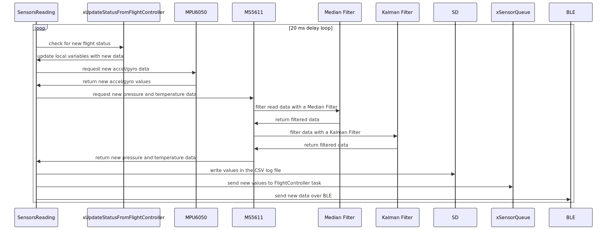
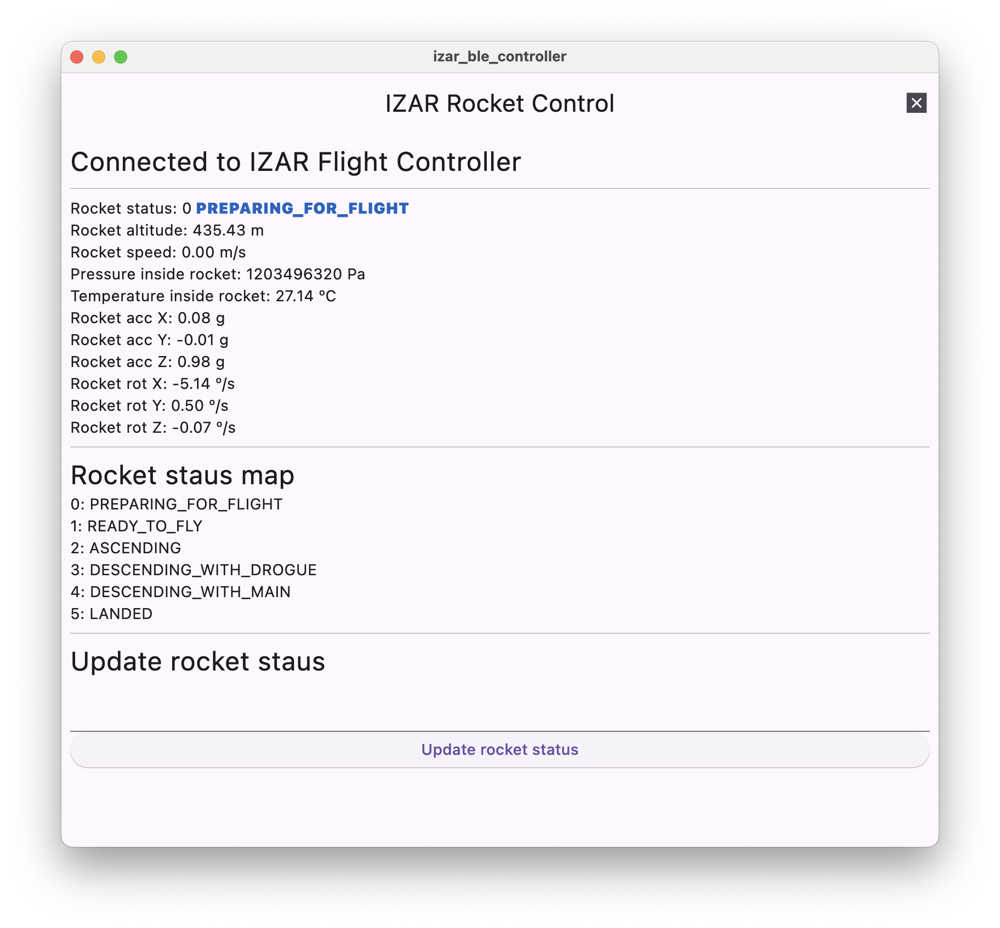
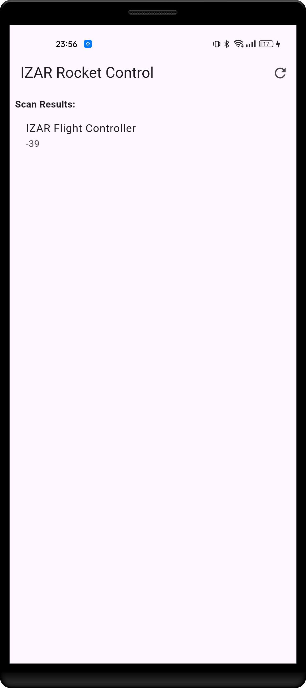

# 🚀 IZAR Flight Controller (IFC)

[](LICENSE.md)

[](https://platformio.org/)

A flight controller for real-time data gathering, parachute deployment and status control.

---

## 📝 Introduction

This firmware runs on an ESP-WROOM-32 microcontroller under ESP-IDF and FreeRTOS to manage the sensing, filtering, logging, and control required for a safe rocket flight.

| Feature                    | Status | Source                | Notes                                      |
|----------------------------|:------:|-----------------------|--------------------------------------------|
| MPU6050 IMU                | ✅     | `mpu6050_c.c`         | 3-axis accel & gyro                        |
| MS5611 Barometer           | ✅     | `ms5611_c.c`          | Pressure & altitude                        |
| 1D Kalman Filter           | ✅     | `kalman_filter.c`     | Customizable noise parameters              |
| SD Card Logging            | ✅     | `sd_c.c`              | CSV output; Logging data every 200 ms      |
| BLE Telemetry              | ✅     | `ble_c.c`             | Remove control and data dashboard          |
| Flight Control Logic       | ✅     | `flight_controller.c` | Flight state machine                       |

Below is a high-level diagram of task interactions and hardware components:




## 🛠️ FreeRTOS Task Architecture

In order to maximize both cores on the ESP32, FreeRTOS is used to handle tasks, timers and parallel processing. Two FreeRTOS tasks handle the main algorithms on the Flight Controller.

1. **SensorsReadingTask** (Priority 5, ~50 Hz loop)  
2. **FlightControllerTask** (Priority 3, ~20 Hz loop)

Tasks are created in \ref app_main after queue setup:

```c
xTaskCreate(sensors_reading, "SensorsReadingTask", 4096, NULL, 5, NULL);
xTaskCreate(flight_controller, "FlightControllerTask", 4096, NULL, 3, NULL);
```



---

### SensorsReading Task

This task is in charge of reading information from the sensors, computing that information and sending it to the Flight Controller to decide when to fire the chute charges. It also servers two other goals: the first one is to save all the data into an SD card so that is available for review after flight. The second one is allowing a Bluetooth Low Energy (BLE) connection for real time data monitoring and deactivating the rocket status of PREPARING_FOR_FLIGHT.

- **Init**: Configure SPI, I2C and BLE (based on active sensors).
- **Loop (20 ms delay)**:
  1. Check if the Flight Controller is reporting a new rocket status
  2. Read MPU6050 linear and angular accelerations
  3. Read MS5611 pressure and temperature
    1. Filter pressure and temperature
    2. Compute altitude
    3. Compute vertical speed (Δaltitude / Δtime)
  4. Log CSV line to SD card
  5. Send new measurements to the Flight Controller Task
  6. Update BLE data (≤2 Hz)



### FlightController Task

This task is in charge of analyzing the sensors data and taking decisions. It is the responsible of changing the rocket status and of detecting the best moment for chute ejection charge firing.

- **Init**: configuration of all variables and status 
- **Process**:  
  1. Read available data from xSensorsQueue
  2. Calculate mobile mean for altitude
  3. Depending on the rocket status, select the decision-making algorithm of that state
  4. If the rocket status state has been updated, send it over xUpdateStatusFromFlightController to the SensorsReadingTask



---

## 🔄 Inter-Task Communication

- **xSensorQueue** (length 1): `SensorDataQueue_t` from SensorsReading → FlightController  
- **xUpdatedStatus** (length 1): `ROCKET_STATUS_T` from FlightController → SensorsReading  

Queues ensure thread-safe, mutex-free data passing. The single-slot design always delivers the latest data without backlog.

### xSensorQueue

This queue is used to send data read and processed in the SensorsReading task to the Flight Controller. The SensorsReading task handles a more measurements than what FlightController needs so only the necessary information is sent. The information structures in the \ref SensorDataQueue_t structure. The structure contains:
1. The current rocket status. This is needed because the user can update though the BLE connection the status and the SensorsReading task is the one controlling it.
2. The current rocket altitude.
3. The rocket linear acceleration in axes X, Y and Z.


### ROCKET_STATUS_T

The only information that has to be sent from the FlightController task to the SensorsReading task is the new flight status. That is the reason why the queue has only the amount of space needed to fit this value.

1. Current rocket status determined by the FlightController task


---

## 🚦 Rocket Flight State Machine

The Flight Controller relies on a Finite State Machine in order to determine the actions and steps it needs to take. This ensures safety measures and guarantees that actions occur in a certain order for a successful flight.

As a safety measurement, the rocket will no deploy any ejection charges until the rocket status is manually updated via the BLE application. This ensures that no explosions occur during launchpad installation. The state machine also guarantees that parachutes are deployed in the correct order: first drogue and later main.



- **PREPARING_FOR_FLIGHT**: the controller is on and working but it will remain in this state until it is manually updated from the BLE connection. This is done for safety reasons so that if during manipulation charges are not ignited.
- **READY_TO_FLY**: the rocket is in the launch pad ready to fly. At this point the motor can be ignited and thanks to the acceleration liftoff will be automatically detected.
- **ASCENDING**: the rocket motor is on and it is going up. When apogee is detected the drogue chute will be deployed.
- **DESCENDING_WITH_DROGUE**: the rocket is falling with the drogue chute and is monitoring altitude for main chute deployment.
- **DESCENDING_WITH_MAIN**: the rocket is falling with the main chute.
- **LANDED**: the rocket has touched the ground.

---

## 📊 Data Logging & Telemetry

### CSV Logging:
The SensorsReading task records all read data into the SD card for future processing. This helps retrieving all the information from the flight. The systems sores a new file called LOGX.CSV where X is an incremental number to keep all the previously recoded information. The information recorded is the next one:

| Value          | Units              | Description                         | Column name        |
|----------------|--------------------|-------------------------------------|--------------------|
| Time           | Milliseconds       | Time since boot                     | Time(ms)           |
| Rocket status  | Enum               | Rocket status value                 | RocketStatus       |
| Pressure       | Pascals            | Pressure inside the rocket          | Pressure(Pa)       |
| Altitude       | Meters             | Altitude of the rocket              | Altitude(m)        |
| Vertical speed | m / s              | Vertical speed of the rocket        | VerticalSpeed(m/s) |
| Temperature    | Degrees Celsius    | Temperature inside the rocket       | Temperature(ºC)    |
| Acceleration X | G-Forces           | Linear acceleration in the X axis   | AccX(g)            |
| Acceleration Y | G-Forces           | Linear acceleration in the Y axis   | AccY(g)            |
| Acceleration Z | G-Forces           | Linear acceleration in the Z axis   | AccZ(g)            |
| Rotation X     | Degrees per second | Angular speed of rotation in X axis | RotX(º/s)          |
| Rotation Y     | Degrees per second | Angular speed of rotation in Y axis | RotY(º/s)          |
| Rotation Z     | Degrees per second | Angular speed of rotation in Z axis | RotZ(º/s)           |

The file is flushed every loop. This strategy has been chosen due to the fact that, in case of a disaster, the SD card would contain up to the latest recorded value and would be helpful for analysis.


### BLE GATT
Twice a second, the Flight Controller broadcasts over BLE sensor data and flight status parameters. This information can be read with a BLE client or with a custom made application for it. The BLE connection allows for communication and manually changing the value of the rocket status.

The custom application has been developed in Flutter and it is compatible with IOS, Android, macOS, Windows and Linux. Disclaimer: it has only been tested in Android and macOS.

#### macOS screen captures

<p float="left">
  
  
</p>

#### Android screen captures
<p float="left">
  
  
</p>

---

## 🛡️ License

Released under the Creative Commons Attribution-NonCommercial-ShareAlike 4.0 International (CC BY-NC-SA 4.0) License with additional obligations.

© 2025 Imanol Gutierrez Pinedo.